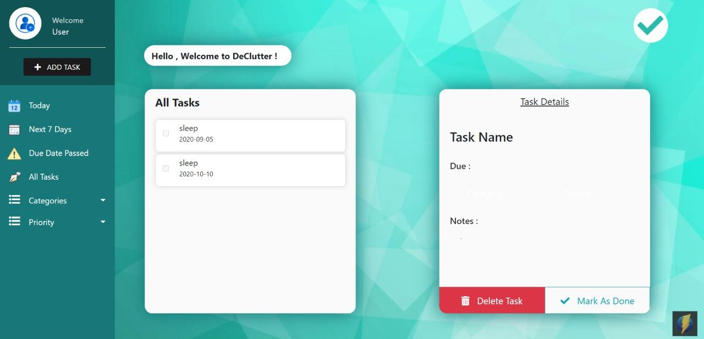
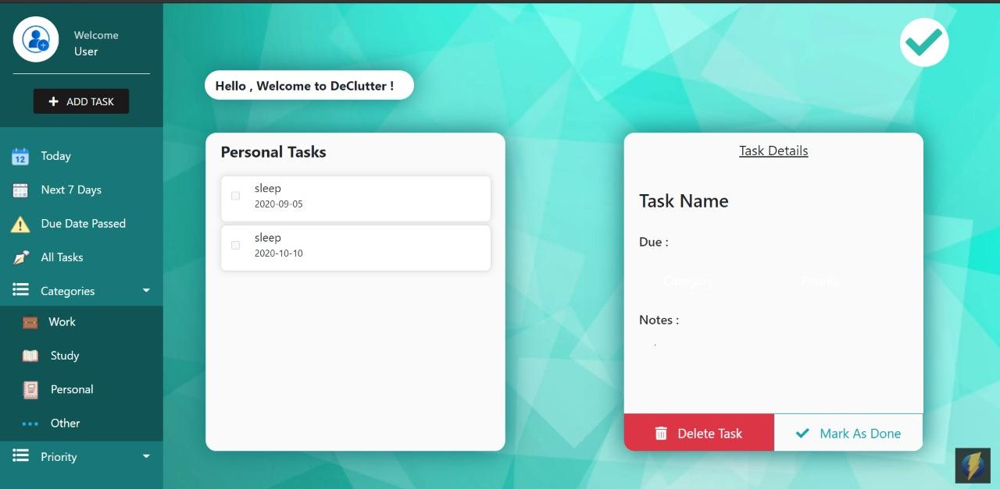
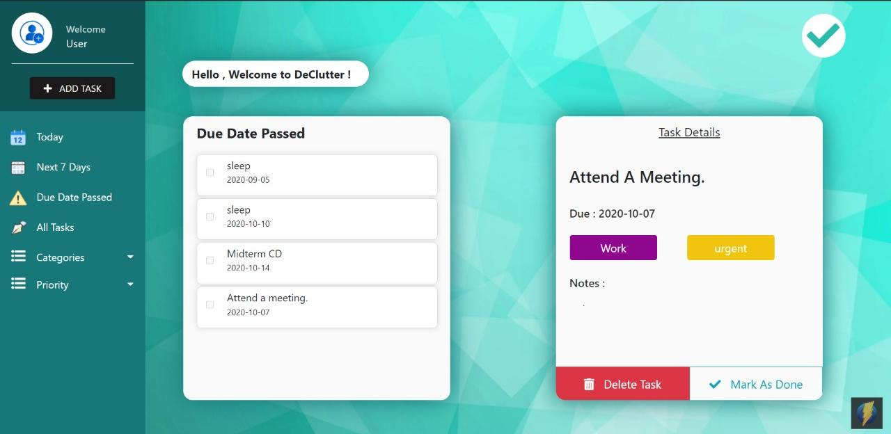
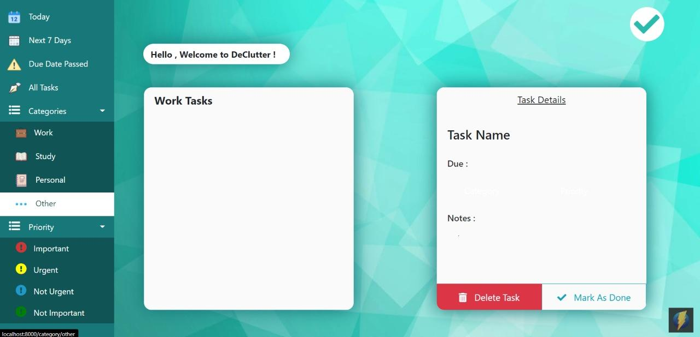
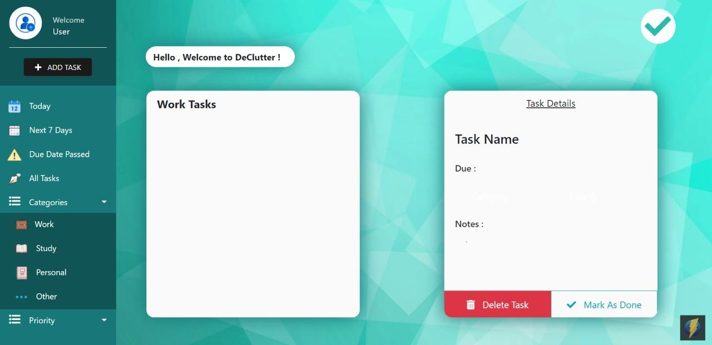

# To Do List Web App - DeClutter 

## To run this app, the following scripts are available:

### `npm install`

Installs the required dependencies to run the app

### `node index.js`

Will start the server at [http://localhost:8000](http://localhost:8000) 

## features 

- Does Filtering on the basis of
    - Due Date
    - Category
    - Priority

- Each list is sorted on the basis of date and if it is completed or not

- See detail of each task

## Clone this and enjoy!!
